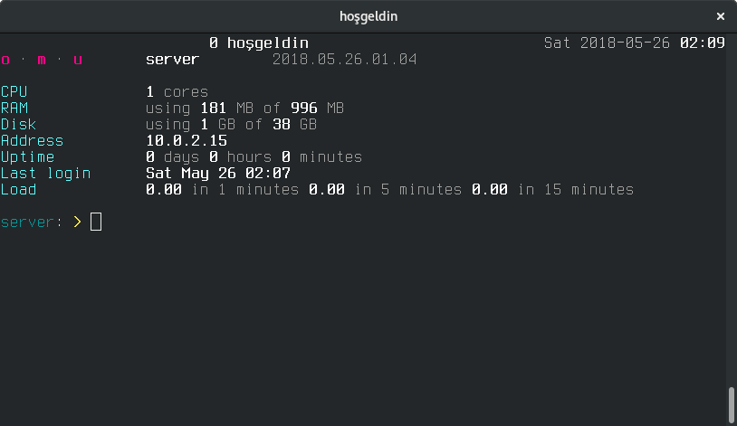

Makineler
=========



Packer ile *dağıtım-sürüm-tür-sağlayıcı.box* formunda Vagrant makineleri
üretiliyor.  Örneğin *debian-stable-server-virtualbox.box* makinesi Virtualbox
için Debian kararlı sürümü (dokümanın yazıldığı tarih itibarıyla `stretch`) baz
alan sunucu makinesi oluyor.  İsimdeki her alan ve desteklenen seçenekler:

- **dağıtım**

  Baz alınan dağıtım: *debian*, *ubuntu*

- **sürüm**

  İlgili dağıtım sürümü: *legacy*, *stable*, *unstable*

  Debian'da:

  + *legacy*: jessie
  + *stable*: stretch
  + *unstable*: sid

  Ubuntu'da:

  + *legacy*: xenial
  + *stable*: bionic
  + *unstable*: cosmic

- **tür**

  Makina türü: *server*.  Bir tür potpuri olmasından dolayı buna "medley" de deniliyor.

- **sağlayıcı**

  Packer "provider": *virtualbox*, *vmware*, *kvm*, *lxc*

Tüm makineler için ortak özellikler:

- Sadece amd64 mimarisi kullanılıyor

- Kullanıcı ve parola `op`

- Paylaşılan Vagrant dizini `/vagrant`

- Makinelerde `/etc` dizini altındaki yapılandırmalar sistem genelinde
  uygulanmış durumda

- Makinelerde `/bin` dizini altındaki yardımcı araçlar sistem genelinde kurulu
  durumda

Makineler Vagrant box biçimli dosyalarla üretildiğinden makine için farklı bir
biçim elde edilmek isteniyorsa box dosyalar açılarak içindeki dosyalar
kullanılabilir.  Örneğin:

- Debian kararlı sürüm sunucu makinesini VMware VSphere'de konuşlandırmak için
  gereken OVA dosyasını şöyle elde ediyoruz:

  ```sh
  tar xvf debian-stable-server-vmware.box
  ```

- Debian kararlı sürüm sunucu makinesini KVM destekleyen bir ortamda
  konuşlandırmak için gereken qcow2 imaj dosyasını şöyle elde ediyoruz:

  ```sh
  tar xvf debian-stable-server-kvm.box
  ```

Hazırlık
--------

Olağan [Packer kurulumundan](https://www.packer.io/downloads.html) sonra inşa
öncesinde desteklenen her sağlayıcı için aşağıdaki hazırlıkların yapılması
gerekiyor.

### Virtualbox

#### Kurulum

Virtualbox Wiki'deki [kurulum
yönergesini](https://www.virtualbox.org/wiki/Linux_Downloads) izleyin.
Virtualbox'ın son sürümüyle çalışabilmek için lütfen dağıtımla birlikte gelen
paketleri kullanmayın.

### KVM

#### Kurulum

```sh
apt-get install qemu qemu-kvm
```

### LXC

#### Kurulum

Baz paketleri kur

```sh
apt-get install lxc debootstrap
```

Port yönlendirme için gerekli paketi kur

```sh
apt-get install redir
```

#### Yapılandırma

*/etc/default/lxc-net* dosyasını düzenle

```sh
echo 'USE_LXC_BRIDGE="true"' >/etc/default/lxc-net
```

*/etc/lxc/default.conf* dosyasını düzenle

```sh
cat >/etc/lxc/default.conf <<'EOF'
lxc.network.type = veth
lxc.network.flags = up
lxc.network.link = lxcbr0
lxc.network.name = eth0
lxc.network.hwaddr = 00:16:3E:xx:xx:xx
EOF
```

Servisleri aktifleştir

```sh
systemctl enable lxc
systemctl enable lxc-net
```

Servisleri yeniden başlat

```sh
systemctl restart lxc
systemctl restart lxc-net
```

#### Vagrant

Vagrant LXC eklentisini kur

```sh
vagrant plugin install vagrant-lxc
```

`sudo` parolası sormasını engelle

```sh
vagrant lxc sudoers
```

### VMware

VMware kurulumu veya yükseltilmesi, ücretsiz VMware Workstation Player olarak
aşağıda özetlenmiştir.  Bu işlemler süresince yerelin `en_US-UTF8` veya `C`
olmasına dikkat edin.  Başarılı bir kurulum sonrasında:

- `vmplayer` ve `vmrun` PATH'te görünmeli

  ```sh
  which vmplayer
  which vmrun
  ```

- Çekirdek modülleri kurulu olmalı

  ```sh
  lsmod | grep -E "vmmon|vmnet"
  ```

- VMware servisleri çalışıyor olmalı

  ```sh
  systemctl status vmware
  ```

#### Kurulum

Baz kurulum yap

- [VMPlayer kur](https://www.vmware.com/tr/products/workstation-player/workstation-player-evaluation.html)


- [VMware-VIX kur](https://my.vmware.com/web/vmware/free#desktop_end_user_computing/vmware_workstation_player/12_0|PLAYER-1200|drivers_tools)

Çekirdek modüllerini derle

- https://github.com/mkubecek/vmware-host-modules/ deposunu klonla

  ```sh
  git clone https://github.com/mkubecek/vmware-host-modules/
  ```

- Uygun dala geç (ör. 14.0.0 için)

  ```sh
  git checkout player-14.0.0
  ```

- Derle

  ```sh
  for d in vmmon-only vmnet-only; do
          pushd "$d"
          make
          popd
  done
  ```

- Kopyala

  ```sh
  sudo cp vmmon.o /lib/modules/`uname -r`/misc/vmmon.ko
  sudo cp vmnet.o /lib/modules/`uname -r`/misc/vmnet.ko
  ```

- Etkinleştir

  ```sh
  sudo depmod -a
  sudo systemctl enable vmware
  sudo systemctl restart vmware
  ```

VMWare araçlarını kur

- VMware Workstation Player arayüzünde "Player Preferences → Download All
  Components Now" ile araçları kur

#### Yükseltme

- VMware Workstation Player arayüzünde "Help → Software Updates" ile yükseltme
  yap

- Yükseltme sonrası çekirdek modülleri tekrar derle.  Örneğin 14.0.0'dan 14.1.1
  sürümüne yükseltme gerçekleşmişse çekirdek modüllerinin derlenmesi adımlarını
  14.1.1 dalı için uygula

#### Sorunlar

Sorun: Packer VMware 14.x sürümlerinde aşağıdaki hatayı veriyor

        VMware error: Unable to connect to host.
        Error: The specified version was not found

Geçici çözüm:

```sh
cd /usr/lib/vmware-vix
sudo mv vixwrapper-config.txt vixwrapper-config.txt.orig
sudo cp /usr/lib/vmware/vixwrapper-product-config.txt vixwrapper-config.txt
sudo cp -a Workstation-12.0.0 Workstation-14.0.0
```

İnşa
----

İnşa işlemi bir [Rakefile](Rakefile) ile yürütülüyor.  Packer kurulumuna ilave
olarak kurulum ortamında Ruby ve Rake'in de hazır olmasını sağla.

```sh
sudo apt-get install ruby rake
```

Desteklenen Rake görevleri hakkında yardım almak için (bu dizindeyken)

```sh
rake -T
```

Üretilmesi istenen sağlayıcı türü için gerekli hazırlıklar yapıldıktan sonra bu
dizine girerek aşağıdaki formda rake komutlarını çalıştır:

```sh
rake build:dağıtım:sürüm:tür only=sağlayıcı
```

Örneğin `debian-stable-server-virtualbox.box` makinesini inşa etmek için:

```sh
rake build:debian:stable:server only=virtualbox
```

Rake komutları hiyerarşik formda düzenlenmiştir.  Buna göre:

- Olası tüm makineleri üretmek için

  ```sh
  rake build
  ```

- Olası tüm Debian tüm makineleri üretmek için

  ```sh
  rake build:debian
  ```

- Debian stable sürümünü baz alan tüm makineler için


  ```sh
  rake build:debian:stable
  ```

- Debian stable sürümünü baz alan server makinelerin tüm sağlayıcıları için


  ```sh
  rake build:debian:stable:server
  ```

Özelleştirme
------------

### Şablonlar

Makine üretimi Debian ve Ubuntu için `debian` ve `ubuntu` dağıtım dizinlerindeki
şablonlarla yapılıyor.  Dağıtım dizinlerindeki dosyaların işlevleri:

- `template.json`: Packer şablonu

- `template.rb`: Vagrant şablonu

- `«codename».cfg`: [preseed](https://wiki.debian.org/DebianInstaller/Preseed)
  dosyaları; ör. stretch sürümü için `stretch.cfg`

### Provizyonlama

Provizyonlama `/srv/scripts` altındaki kabuk betikleriyle yapılıyor.  Bu dizinde
her makine **türü** için tür ile aynı isimde bir kabuk betiği ("medley")
bulunuyor; ör. "server" için `/srv/scripts/server.sh`.

"Medley"ler `/lib/scripts` altında sınıflanmış asıl provizyonlama betiklerini
süren üst betikler oluyor.  "Medley"de [she](https://github.com/alaturka/she)
aracının sunduğu ince ve basit bir DSL kullanılıyor.  Bu DSL sayesinde
provizyonlama aşamasında bu depo makineye çekilip içine girilerek ilgili
betiklerin çalıştırılması sağlanıyor.

Bu bilgilere göre makinelerde özelleştirme yapılacaksa `/srv/scripts` ve
`/lib/scripts` betiklerinde çalışmak gerekiyor.  Ayrıntılar için ilgili
dizinlerdeki dokümanları okuyun.
